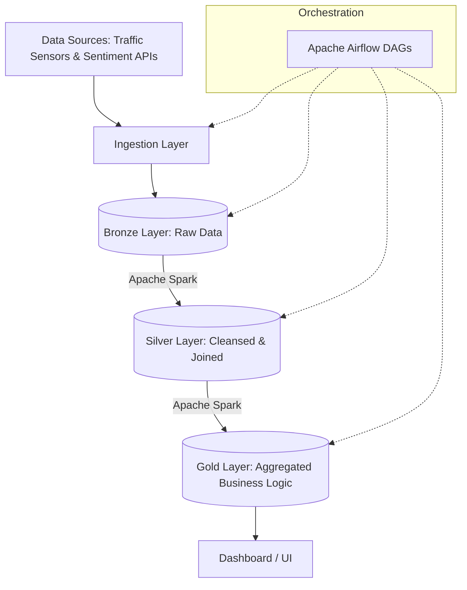

# Urban Traffic Crash Risk & Public Sentiment Intelligence Platform


## Project Overview
The **Urban Traffic Crash Risk & Public Sentiment Intelligence Platform** is a scalable data engineering solution designed to correlate urban traffic collision data with real-time public sentiment. By leveraging a robust data pipeline, this platform ingests, processes, and analyzes high-volume traffic events to generate actionable intelligence for city planning, routing optimization, and public safety.

## Architecture Diagram
The data pipeline is built upon a **Medallion Architecture** (Bronze, Silver, and Gold layers), orchestrated by Apache Airflow, and processed using distributed Apache Spark jobs.



## Components

### Software Stack
* **Apache Spark:** Handles the heavy lifting of distributed data processing and schema enforcement across the Medallion layers.
* **Apache Airflow:** Manages workflow orchestration, dependency tracking, and task scheduling.
* **Python:** The core language used for ingestion logic, Spark jobs, and the visualization dashboard.
* **Docker & Docker Compose:** Containerizes the application components, ensuring an isolated and reproducible deployment environment.
* **SQL:** Utilized for defining analytical queries and views within the Gold layer.
* **Shell Scripts:** Automates environment setup and pipeline execution (`run.sh`).

### Hardware / Infrastructure Components
* **Edge Sensors (IoT Data Sources):** Urban traffic cameras, radar sensors, and telemetry units that capture real-world traffic flows and crash metrics.
* **Compute Cluster:** High-performance instances or virtual machines designated to run the Spark processing nodes and Docker containers.
* **Storage Layer:** A highly available, distributed file system or cloud object storage provisioned to house the massive data volumes in the Bronze, Silver, and Gold data lakes.

## Repository Structure
```text
├── airflow/           # Airflow DAGs and operator configurations
├── api/               # Endpoint handlers for external data ingestion
├── config/            # Environment variables and configuration files
├── diagram/           # Architectural design files and flowcharts
├── ingestion/         # Scripts to pull raw traffic and sentiment data
├── logs/              # Execution logs
├── metadata/          # Schema definitions and tracking metadata
├── processing/        # Spark jobs for Bronze, Silver, and Gold layers
├── scripts/           # Utility bash and automation scripts
├── sql/               # SQL queries for the Gold layer analytics
├── utils/             # Helper functions and shared Python modules
├── Dockerfile         # Docker image definition
├── dashboard.py       # User interface and metric visualization
├── docker-compose.yml # Multi-container orchestration 
├── requirements.txt   # Python dependencies
└── run.sh             # Main execution wrapper script
```

## Setup & Installation

1. **Clone the repository:**
```bash
   git clone [https://github.com/dhilipan182005/Urban-Traffic-Crash-Risk-Public-Sentiment_Project.git](https://github.com/dhilipan182005/Urban-Traffic-Crash-Risk-Public-Sentiment_Project.git)
   cd Urban-Traffic-Crash-Risk-Public-Sentiment_Project
   ```

2. **Build the Docker Environment:**
   Initialize the containers for Airflow, Spark, and dependencies.
```bash
   docker-compose up -d --build
   ```

3. **Initialize the Pipeline:**
   Execute the setup script to establish the required environment configurations and trigger the initial Airflow instance.
```bash
   chmod +x run.sh
   ./run.sh
   ```

4. **Access the Interfaces:**
   * **Airflow UI:** Navigate to `http://localhost:8080` to monitor DAG execution.
   * **Dashboard:** Run `python dashboard.py` and access the visual metrics via the specified local port.

## Contributing
Contributions, issues, and feature requests are welcome. Feel free to check the [issues page](https://github.com/dhilipan182005/Urban-Traffic-Crash-Risk-Public-Sentiment_Project/issues) to propose changes or report bugs.
